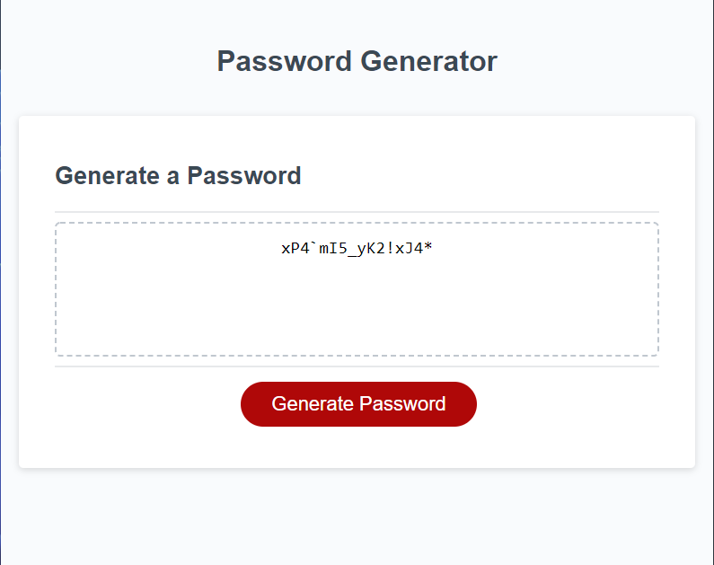

# password-generator

## Description

Password generator using javascript. User can choose the length of the password and whether or not to include the following:

- Lowercase characters
- Uppercase characters
- Numbers
- Special characters

## Live URL and screenshot

The password generator is live at this [url](https://anisha-sapkota.github.io/password-generator/) and the screenshot below.

## Helpful Resources

- <https://www.w3schools.com/jsref/jsref_round.asp>
- <https://www.w3schools.com/jsref/jsref_isnan.asp>
- <https://www.w3schools.com/jsref/jsref_floor.asp>
- <https://www.w3schools.com/jsref/jsref_charat.asp>
